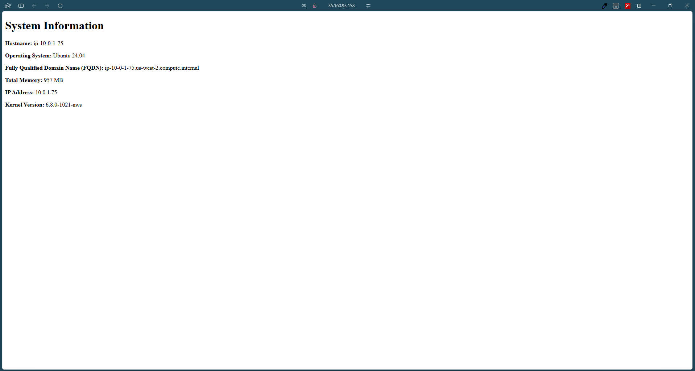
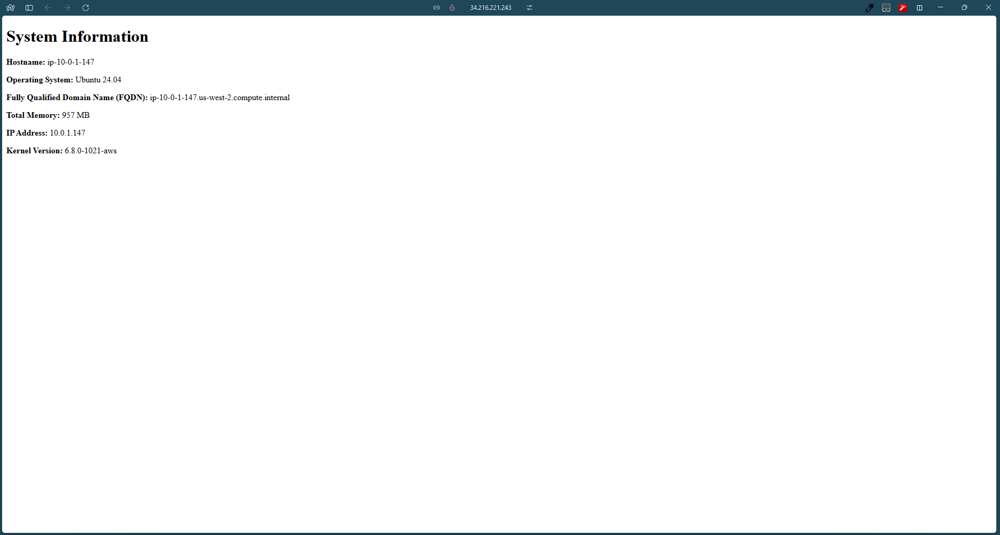

# ACIT 4640 Week 7 Lab

## Overview

This lab sets up two AWS EC2 instances using Terraform and configures them with Nginx using Ansible. The playbook installs Nginx, sets up the necessary directories, deploys an index.html file using a Jinja2 template, and ensures the web server is running.

## Prerequisites

- AWS account with necessary permissions
- Terraform installed
- Ansible installed
- Git installed

## Setup Instructions

### 1. Clone the Repository

```bash
git clone https://gitlab.com/cit_4640/4640-w7-lab-start-w25.git
cd 4640-w7-lab-start-w25
```

### 2. Create an SSH Key Pair

```bash
ssh-keygen -t rsa -b 4096 -f ~/.ssh/aws
```

### 3. Import SSH Key to AWS

```bash
./import_lab_key ~/.ssh/aws.pub
```

### 4. Deploy EC2 Instances with Terraform

```bash
terraform init
terraform apply -auto-approve
```

### 5. Update Ansible Inventory

Edit `ansible/inventory/hosts.yml` with the new EC2 instance public IPs:

```yaml
all:
  children:
    web:
      hosts:
        server-one:
          ansible_host: <NEW_PUBLIC_IP_1>
          ansible_user: ubuntu
          ansible_ssh_private_key_file: ~/.ssh/aws
        server-two:
          ansible_host: <NEW_PUBLIC_IP_2>
          ansible_user: ubuntu
          ansible_ssh_private_key_file: ~/.ssh/aws
```

### 6. Run the Ansible Playbook

```bash
ansible-playbook -i ansible/inventory/hosts.yml ansible/playbook.yml
```

### 7. Verify the Webpage

- Open a browser and go to `http://<PUBLIC_IP>`

### 8. Cleanup Resources

```bash
terraform destroy -auto-approve
./delete_lab_key
```

## Screenshot



